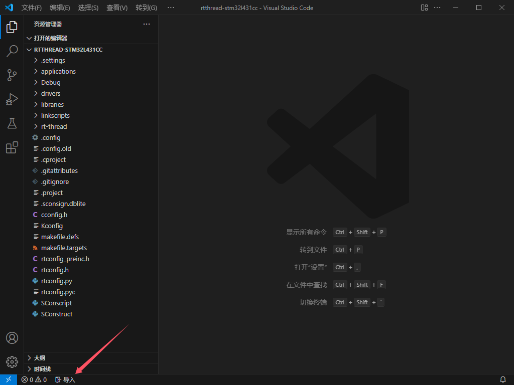
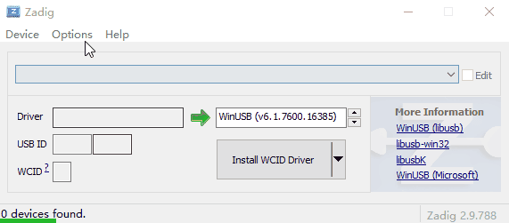
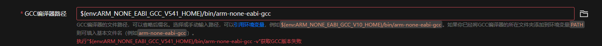
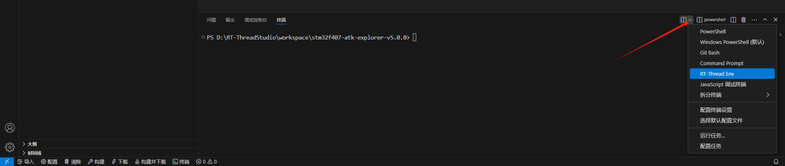

# RT-Thread Studio项目助手

简体中文 | [English](#rt-thread-studio-project-assistant)

[](https://marketplace.visualstudio.com/items?itemName=jswyll.jswyll-vscode-rtthread)

> 本扩展适用于使用RT-Thread Studio新建或导入的项目，可生成vscode的代码浏览、编辑、编译、下载、调试的配置文件。

## 快速开始

1. 使用RT-Thread Studio新建或导入的项目，在RT-Thread Studio构建一次

2. 在vscode中安装并启用本扩展（`jswyll.jswyll-vscode-rtthread`），依赖的扩展会被自动安装。

3. 打开项目根目录（`.cproject`文件的所在文件夹），点击状态栏的“导入”按钮

    

4. 根据配置面板提示填写相关信息

    点击“RT-Thread Studio路径”右方的打开文件按钮，选择RT-Thread Studio安装路径（`studio.exe`的所在文件夹）

    根据情况选择调试器类型及其接口

    点击“生成”按钮

    

5. 点击状态栏的“构建并下载”按钮（或按快捷键`Ctrl+Shift+B`）

    

## 软件特性

- 解析项目信息，生成vscode的配置文件：

  - 可视化：通过配置向导面板进行输入或选择参数。从环境变量`PATH`中寻找可用的GCC编译器；Windows环境下选择RT-Thread Studio路径后，自动寻找GCC编译器路径、Make工具路径、调试器服务器等以供选择

  - 代码浏览：生成C/C++浏览配置（`.vscode/c_cpp_properties.json`）的宏定义、头文件（搜索）路径；根据排除路径生成vscode资源管理器排除规则（`files.exclude`）。

  - 程序编译：

    - 多进程编译加快速度；如果make的主版本号大于4，添加`--output-sync=target`避免不同文件的编译报错混淆。

    - 屏蔽编译和链接的一长串参数输出，并添加形如Keil IDE的编译与链接提示：

      ```sh
      compiling ../rt-thread/src/clock.c...
      compiling ../rt-thread/src/components.c...
      compiling ../rt-thread/src/device.c...
      compiling ../applications/main.c...
      linking ...
      arm-none-eabi-objcopy -O binary "rtthread.elf"  "rtthread.bin"
      arm-none-eabi-size --format=berkeley "rtthread.elf"
      text    data     bss     dec     hex filename
      55400    1468    3368   60236    eb4c rtthread.elf
      ```

    - 提供更准确的问题匹配器，避免在问题面板打开出错文件跳转失败

  - 下载程序：调试服务器类型支持Segger JLink、PyOCD、OpenOCD（前两个Windows环境下RT-Thread Studio已经内置），调试器类型支持常用的JLink、ST-Link、CMSIS-DAP。

  - 调试程序：调试所支持的调试器类型和下载程序的一样；生成[Cortex-Debug](https://marketplace.visualstudio.com/items?itemName=marus25.cortex-debug)扩展的调试启动配置。

  

- [跨平台开发](#其它平台)：已在Windows、MacOS（10.13和15.2）、Linux（Ubuntu 24.04）上测试通过。

- [检查中断函数](中断检查)：检查形如`void xxx_IRQHandler(void)`的函数是否调用了`rt_interrupt_enter()`和`rt_interrupt_leave()`。

- 国际化：支持简体中文和英文。

## 操作说明

vscode支持[多根工作区](https://code.visualstudio.com/docs/editor/multi-root-workspaces)，可以在一个工作区中同时打开多个工程。

本扩展兼容多根工作区。如果打开的是多根工作区且有多个根文件夹，将弹出工作区文件夹的选择器：


后续的操作都将基于该文件夹，相关的配置文件会保存在该工作区文件夹。可以通过点击状态栏的子模块图标来再次切换。

> **说明**
>
> 以下所提到的“工作区文件夹”都是指已选择的根文件夹。如果打开的是单个文件夹或多根工作区下只有一个根文件夹，“工作区文件夹”就是指这个文件夹。

### 扩展激活

启用扩展后，当工作区文件夹中（第一级）有`.cproject`文件或`rt_config.py`文件时，扩展会自动激活。

### 导入项目

点击状态里的“导入”来生成vscode的配置文件。

> **说明**
>
> - 重复生成应该是没有副作用的，需要修改或更新选项的时候可以再生成。
>
> - 项目可以是已经移动的（不在RT-Thread Studio workspace文件夹中的）。

#### 面板选项

- **构建配置**：在RT-Thread Studio项目中创建的构建配置。如果只有一个则无需选择。必要项。

- **RT-Thread Studio路径**：你的RT-Thread Studio安装路径（`studio.exe`的所在文件夹）。目前仅用于推导可能的工具位置以供选择。非Windows平台没有这个选项。非必要项。

- **GCC编译器路径**：用于C/C++扩展分析代码、编译程序。必要项。

  可以直接选择RT-Thread Studio内置的5.4.1和10.3.1的arm-none-eabi两个版本：

  

  对于ARM架构的芯片，可以前往<https://developer.arm.com/downloads/-/gnu-rm>下载特定的版本。

- **Make工具路径**：用于构建项目。非必要项（如果你只想浏览代码）。

  可以选择RT-Thread Studio内置的`platform/env_released/env/tools/BuildTools/2.12-20190422-1053/bin`。Windows平台可以前往<https://github.com/skeeto/w64devkit/releases>下载命令更丰富的开发包。

- **调试服务器**：支持OpenOCD、JLink或PyOCD。非必要项（如果你不需要在vscode下载、调试程序）。

    

  - Segger JLink：可以选择RT-Thread Studio内置的v7.50a，RT-Thread Studio v2.2.8以上还可以选v7.92（推荐）。或者，前往<https://www.segger.com/downloads/jlink>下载特定的版本。特点是：快！

    

    

  - PyOCD：可以选择RT-Thread Studio内置的v0.1.3。但经测试它不支持我的JLink，可以参考<https://pyocd.io/docs/installing>安装最新的新版本（Windows平台pip安装的pyocd可能需要拷贝libusb.dll到python根目录才可用），新版本对ST-Link、JLink和CMSIS-DAP调试器都支持。

    除非是[PyOCD内置目标](https://pyocd.io/docs/builtin-targets.html)，否则需要填写Cmsis包。可以输入关键词然后选择RT-Thread Studio内置的。

    

  - OpenOCD：可以前往<https://github.com/xpack-dev-tools/openocd-xpack/releases>下载，对于Windows还可以前往<https://gnutoolchains.com/arm-eabi/openocd/>下载包含的额外驱动软件的。支持ST-Link、JLink和CMSIS-DAP。特点是：很多芯片厂商都支持。

    

    > **说明**
    >
    > Windows平台选择OpenOCD调试服务器且使用JLink调试器时，需要使用<https://gnutoolchains.com/arm-eabi/openocd/>里的`UsbDriverTool.exe`或[zadig](https://zadig.akeo.ie/)把JLink驱动更换为libusb：
    >
    > 
    >
    > 修改驱动后在MDK IDE就不能使用JLink下载了，可以使用<https://gnutoolchains.com/arm-eabi/openocd/>里的`UsbDriverTool.exe`把驱动恢复为JLlink驱动：
    >
    > 

- **芯片名称**：用于下载程序时让调试器识别出对应的FLASH大小。一般来说保持不变即可。对于STM32，应至少精确到11位字符，例如`STM32L431CC`。

> **说明**
>
> 以上的**xxx路径**选项，你可以通过右方的打开文件图标按钮来选择，可以选择提示的选项，还可以手动输入，见[路径规则](#路径规则)。

#### 开始生成

填写参数的过程中会校验输入是否有效。对于错误，根据提示检查并更正。



对于警告，点击“生成”时会弹窗提示，如果确定可以点击“忽略”按钮。


点击“生成”按钮，开始校验并生成配置文件。如果生成成功，配置面板将自动关闭。

对于JLink，会添加hex输出（这是因为：旧版本RT-Thread Studio内置的`J-Link/v7.50a`不支持解析elf文件）。

> **注意**
>
> 切换编译器版本后（在本扩展的配置面板选择的GCC版本和RT-Thread Studio的不一样，或前后两次在本扩展的配置面板选择GCC版本不一样，先后编译），应重新编译，以消除编译器版本差异引发不可预料的结果。

### 构建项目

可以点击状态栏的图标`清除`、`构建`、`下载`或`构建并下载`来执行构建任务。

也可以在菜单栏->终端->运行任务...来选择`重新构建`任务。


[导入项目](#导入项目)时如果指定了默认构建任务，可以按快捷键`Ctrl+Shift+B`来执行。


任务结束时会提示结果及耗时。


> **说明**
>
> 构建失败时你可以在终端或问题面板跳转到对应的文件位置：
>
> 
>
> 
>
> 修改代码后不会立刻移除错误标记，需要再次执行构建任务。

### 下载运行

可以安装微软的“串行监视器”扩展来查看串口输出或当作终端来操作：

```plaintext
名称: Serial Monitor
ID: ms-vscode.vscode-serial-monitor
说明: Send and receive text from serial ports.
发布者: Microsoft
VS Marketplace 链接: https://marketplace.visualstudio.com/items?itemName=ms-vscode.vscode-serial-monitor
```


### 调试代码

按F5键或“菜单栏->运行->启动调试”来开始调试。

除了常规的GDB调试功能以外，Cortex-Debug扩展还支持查看内存、片上外设寄存器等功能，详情请查看[Cortex-Debug文档](https://marketplace.visualstudio.com/items?itemName=marus25.cortex-debug)。

可以在vscode扩展搜索`Cortex Debug Device Support Pack`安装对应芯片系列的片上外设支持包。

> **说明**
>
> 调试任务启动前会调用默认构建任务，调试任务启动时会下载程序，所以启动或重启调试任务无需先点击构建或下载。

### 目录检测

对于已加入编译的文件夹，当文件夹内（第一级）有新增或移除的文件时，会自动更新对应的makefile规则。


可以在扩展设置中关闭。

> **说明**
>
> 本扩展开发时参考了[eclipse-cdt - gnu2/GnuMakefileGenerator.java](https://github.com/eclipse-cdt/cdt/blob/main/build/org.eclipse.cdt.managedbuilder.core/src/org/eclipse/cdt/managedbuilder/makegen/gnu2/GnuMakefileGenerator.java)自动生成makefile的源码，目前只实现了更新它已经生成的makefile。如果自动更新有问题，可以在扩展设置中关闭此功能，然后在RT-Thread Studio构建项目一次，相关的文件会还原为GnuMakefileGenerator自动生成的值。

## RT-Thread Env

### 先决条件

1. 已安装好Env Windows。（对于Env v2.x联网环境方式，需要先启动一次env.exe以下载相关依赖。）

2. 支持scons方式编译的项目。

打开BSP的所在文件夹（`BSP_DIR`），例如：

- 第一种：已经是RT-Thread标准项目框架的：

    ```sh
    stm32f407-atk-explorer/ # BSP_DIR
    ├── applications/
    ├── packages/  # PKGS_DIR (PKGS_ROOT)
    ├── rt-thread/ # RTT_DIR
    ├── ...
    ├── Kconfig
    ├── SConscript
    ├── SConstruct
    ├── rtconfig.h
    └── rtconfig.py
    ```

- 第二种：是RT-Thread仓库下的某个BSP：

    ```sh
    rt-thread/ # RTT_DIR
    ├── bsp/
    │   └── stm32/
    │       ├── libraries/
    │       ├── ...
    │       └── stm32f407-atk-explorer # BSP_DIR
    │          ├── applications/
    │          ├── packages/ # PKGS_DIR (PKGS_ROOT)
    │          ├── ...
    │          ├── Kconfig
    │          ├── SConscript
    │          ├── SConstruct
    │          ├── rtconfig.h
    │          └── rtconfig.py
    ├── ...
    ├── src/
    ├── tools/
    └── Kconfig
    ```

### 生成配置

1. 点击状态栏的“导入”图标按钮，弹出配置面板：

    

    - **Env工具路径**：`ENV_ROOT`，即`tools`文件夹的所在文件夹。例：

      - `c:/env-windows`（v2.x 离线环境方式安装）

      - `E:/BaiduNetdiskDownload/env-windows-v2.0.0/env-windows`（v2.x 联网环境方式安装）

      - `C:/Users/jswyll/.env`或`${userHome}/.env`（v2.x [powershell方式安装](https://github.com/RT-Thread/env)）

      - `E:/BaiduNetdiskDownload/env_released_1.3.5_gcc10_python2/env-windows-v1.3.5`（v1.x 无需虚拟环境）

    - **RTT根目录**：`RTT_DIR`，RT-Thread源码的主目录。以前面的BSP`stm32f407-atk-explorer`为例，第一种填`rt-thread`，第二种情况填`../../..`。

2. 其它选项与RT-Thread Studio的配置方式一致。

3. 点击“生成”按钮并等待生成完毕。

如果操作无误状态栏应显示“配置”和“终端”图标按钮：


### 菜单配置

> **说明**
>
> 对于Env v2.x，安装好依赖后，除非本扩展无法正常使用，否则 **无需** 且 **不建议** 运行`${ENV_ROOT}/env.ps1`或`${ENV_ROOT}/.venv/Scripts/Activate.ps1`激活虚拟环境。

1. 点击状态栏的“配置”图标按钮，弹出菜单配置面板：

    

2. 单击菜单项的标题（或最左边侧的图标）可以展开或折叠菜单，有几类配置项：

    - 整数（`int`）

    - 十六进制数（`hex`）

    - 字符串（`string`）

    - 布尔（`bool`）

    - 单项选择（`choice`）

    

3. 可以在搜索框中输入关键词搜索配置项（或菜单项）：

    

    关键词可以是以下之一中的字词：

    - 名称，例如`RT_NAME_MAX`

    - 标题，例如`The maximal size of kernel object name`，

    - 帮助，例如`Each kernel object, such as thread, timer, semaphore etc, has a name,the RT_NAME_MAX is the maximal size of this object name.`

    - 翻译后的标题，例如`内核对象名称的最大大小`

    - 翻译后的帮助，例如`每个内核对象，如线程、定时器、信号量等，都有一个名称。 RT_NAME_MAX是该对象名称的最大大小。`

4. 如果修改了Kconfig文件，可以点“重新加载”按钮来刷新菜单配置。

    > **说明**
    >
    > 参考[linux内核Kconfig文档](https://www.kernel.org/doc/html/latest/kbuild/kconfig-language.html)了解Kconfig语法。

5. 点击“保存”按钮保存配置，默认自动更新软件包：

    

    > **说明**
    >
    > - 可以在 菜单栏 -> 终端 -> 运行任务... 手动运行该任务：
    >
    >     
    >
    > - 可以在扩展设置中关闭保存配置时自动更新软件包。

### 终端任务

清除、构建、下载、调试的操作方式与RT-Thread Studio类型的一致。本质上是运行定义的`tasks.json`中的任务，可以通过点击状态栏图标按钮、菜单栏、配置快捷键、使用任务扩展等方式运行终端任务。


### 终端集成

- 点击状态栏的“终端”图标按钮，弹出终端面板。可以使用scons、pkgs命令。

    

    menuconfig也勉强（见[使用限制](#使用限制)）可以使用：

    

- 也可以通过点击终端面板右上角的下拉图标来打开终端。

    

### 原始方式

由于还未能和官方取得联系，对接RT-Thread Env方式实现方法是我通过试用各个Env-Windows版本来推测的，如果存在问题，欢迎反馈。

可以在vscode资源管理器上（文件或文件夹）右键，选择“在此处打开ConEmu”，使用原始方式开发：


## 更佳实践

本扩展只实现了一小部分功能，可能不满足实际的需求，可以在生成的基础上进行修改；或者，使用其它扩展进行嵌入式开发。不管怎样，以下的操作和建议应该是通用的。

### 其它平台

- Linux发行版（以Ubuntu为例）

1. 切换apt源（非必要项）。参考[阿里云 - Ubuntu 镜像](https://developer.aliyun.com/mirror/ubuntu?spm=a2c6h.13651102.0.0.68a51b11PeE4rU)修改系统配置，加快下载速度。

2. GCC工具链。

    在<https://developer.arm.com/downloads/-/gnu-rm>下载预构建的linux的，例如x86/64架构可以下载[gcc-arm-none-eabi-10.3-2021.10-x86_64-linux.tar.bz2](https://developer.arm.com/-/media/Files/downloads/gnu-rm/10.3-2021.10/gcc-arm-none-eabi-10.3-2021.10-x86_64-linux.tar.bz2?rev=78196d3461ba4c9089a67b5f33edf82a&hash=5631ACEF1F8F237389F14B41566964EC)并解压。

    > **说明**
    >
    > 旧版本的`gcc-arm-none-eabi-gdb`依赖于`libncurses.so.5`库，而Ubuntu18以后已经移除，可以链接到`libncurses.so.6`库：
    >
    > ```sh
    > # 例如10.3.1，假设解压到了 ~/Desktop/software/gcc-arm-none-eabi-10.3-2021.10
    > 
    > ~/Desktop/software/gcc-arm-none-eabi-10.3-2021.10/bin/arm-none-eabi-gdb -v
    > # 报错arm-none-eabi-gdb: error while loading shared libraries: libncurses.so.5: cannot open shared object> file: No such file or directory
    > 
    > # 查看依赖
    > ldd ~/Desktop/software/gcc-arm-none-eabi-10.3-2021.10/bin/arm-none-eabi-gdb
    > #         linux-vdso.so.1 (0x00007fffe41eb000)
    > #         libncurses.so.5 => not found
    > #         libtinfo.so.5 => not found
    > #         libdl.so.2 => /lib/x86_64-linux-gnu/libdl.so.2 (0x000074afbe2ec000)
    > #         libstdc++.so.6 => /lib/x86_64-linux-gnu/libstdc++.so.6 (0x000074afbe000000)
    > #         libm.so.6 => /lib/x86_64-linux-gnu/libm.so.6 (0x000074afbdf17000)
    > #         libgcc_s.so.1 => /lib/x86_64-linux-gnu/libgcc_s.so.1 (0x000074afbe2bc000)
    > #         libpthread.so.0 => /lib/x86_64-linux-gnu/libpthread.so.0 (0x000074afbe2b7000)
    > #         libc.so.6 => /lib/x86_64-linux-gnu/libc.so.6 (0x000074afbdc00000)
    > #         /lib64/ld-linux-x86-64.so.2 (0x000074afbe303000)
    > 
    > # 说明缺少libncurses.so.5和libtinfo.so.5，查找其它可用的libncurses
    > sudo find / -name 'libncurses.so.*'
    > # /usr/lib/x86_64-linux-gnu/libncurses.so.6
    > sudo find / -name 'libtinfo.so.*'
    > # /usr/lib/x86_64-linux-gnu/libtinfo.so.6
    > # 创建软链接
    > sudo ln -s /usr/lib/x86_64-linux-gnu/libncurses.so.6 /lib/x86_64-linux-gnu/libncurses.so.5
    > sudo ln -s /usr/lib/x86_64-linux-gnu/libtinfo.so.6 /lib/x86_64-linux-gnu/libtinfo.so.5
    > 
    > # 验证
    > ~/Desktop/software/gcc-arm-none-eabi-10.3-2021.10/bin/arm-none-eabi-gdb -v
    > # GNU gdb (GNU Arm Embedded Toolchain 10.3-2021.10) 10.2.90.20210621-git
    > # Copyright (C) 2021 Free Software Foundation, Inc.
    > # License GPLv3+: GNU GPL version 3 or later <http://gnu.org/licenses/gpl.html>
    > # This is free software: you are free to change and redistribute it.
    > # There is NO WARRANTY, to the extent permitted by law.
    > ```

3. make。一般是内置的，可以用`make -v`查看版本，如果小于4.0，建议用`sudo apt update && sudo apt install --reinstall make`升级到最新版本。

4. 调试服务器。

    - OpenOCD：

        ```sh
        # 安装OpenOCD，安装后openocd会被添加到环境变量PATH。
        sudo apt install openocd
        ```

    - Jlink：

        ```sh
        # 安装JLink，安装后JLinkExe会被添加到环境变量PATH。
        sudo apt install jlink
        ```

        > **注意**
        >
        > Linux下JLink的可执行文件名为`JLinkExe`。

    - PyOCD：

        ```sh
        # 安装python3
        sudo apt install pyton3

        # 安装python3的venv模块
        sudo apt install python3-venv

        # 创建一个虚拟环境
        python3 -m venv ~/embed-venv
        # 激活虚拟环境
        source ~/embed-venv/bin/activate

        # 在虚拟环境中安装pyocd
        pip3 install pyocd

        # 查看pyocd的所在位置（在~/虚拟环境位置/bin下，例如`~/embed-venv/bin/pyocd`）
        which pyocd
        ```

- MacOS

1. 安装包管理器

    ```sh
    /bin/bash -c "$(curl -fsSL https://raw.githubusercontent.com/Homebrew/install/HEAD/install.sh)"
    ```

    或者，参考brew安装文档`https://docs.brew.sh/Installation`。

2. GCC工具链。

    在<https://developer.arm.com/downloads/-/gnu-rm>下载预构建的MacOS的，例如下载[gcc-arm-none-eabi-10.3-2021.10-mac.pkg](https://developer.arm.com/-/media/Files/downloads/gnu-rm/10.3-2021.10/gcc-arm-none-eabi-10.3-2021.10-mac.pkg?rev=b382d51ec8d34c3fa421cf57ce97f146&hash=86689FEB39DA7A381FF78A2E70F7ABCE)然后安装。安装后位于`/Applications/ARM/bin/arm-none-eabi-gcc`。

3. make。一般是内置的，可以用`make -v`查看版本，如果小于4.0，建议用`brew install make`升级到最新版本。

    > **说明**
    >
    > 新版本的GNU“make”已安装为“gmake”，在`/usr/local/opt/make/libexec/gnubin/make`。

4. 调试服务器

    - OpenOCD：

        ```sh
        # 安装openocd，安装后openocd会被添加到环境变量PATH。
        brew install open-ocd
        ```

    - JLink：

        在<https://www.segger.com/downloads/jlink>下载并安装macOS的`JLink_MacOSX_Vxxx_universal.pkg`文件。

        安装后位于`/Applications/SEGGER/JLink_Vxxx/JLinkExe`

    - PyOCD：

        ```sh
        # 安装python3
        brew install python3

        # 安装pyocd，安装后pyocd会被添加到环境变量PATH。
        python3 -m pip install pyocd
        ```

### 路径规则

支持的路径表达方式：

- 绝对路径。例如：

    ```sh
    D:/RT-ThreadStudio/repo/Extract/ToolChain_Support_Packages/ARM/GNU_Tools_for_ARM_Embedded_Processors/5.4.1/bin/arm-none-eabi-gcc.exe
    ```

- 用户主目录下的路径，例如`${userHome}/env/.venv/Scripts`。

- 相对于工作区文件夹的路径。例如`tools/make.exe`。

- 已添加到[环境变量](#环境变量)`PATH`中的路径。例如openocd工具在`D:/openocd-v0.12.0-i686-w64-mingw32/bin/openocd.exe`，把`D:/openocd-v0.12.0-i686-w64-mingw32/bin`添加到环境变量`PATH`中后，可以填写`openocd.exe`。

- 可以[引用环境变量](https://code.visualstudio.com/docs/editor/variables-reference#_environment-variables)。

> **说明**
>
> 优化建议：
>
> - 虽然Windows的路径分隔符是反斜杠`\`、Linux和MacOS的路径分隔符是斜杠`/`，但在Windows中绝大多数程序都能识别`/`；反而，在Windows中有些程序和命令行会将`\`视为拼接转义（例如`E:\workspace/foo\bar`被解析为`E:workspace/foobar`）从而导致编译失败。因此，可以统一使用`/`。
>
> - 在Windows选择文件路径时，可以省略`.exe`后缀。
>
> - 如果指定的绝对路径与工作区文件夹在同一盘符内，尝试将绝对路径转为相对路径。
>
> 生成配置文件时本扩展会按照这些建议优化路径。

### 环境变量

在跨平台或团队协作中，不同的环境下的工具、库等路径可能不同。如果工具位于项目根目录下，可以引用相对路径；如果在其它路径，引用绝对路径要求每个环境的路径都一样，这显然不太可能。使用环境变量可以解决这种问题。

> **说明**
>
> Windows平台powershell中可以用`Get-ChildItem Env:`来查看环境变量；Linux或MacOS中可以用`printenv`来查看环境变量。

最常见的环境变量是`PATH`，它列举多个文件夹的路径，可以让程序通过环境变量找到需要的工具。例如ARM GCC10.3.1工具的`arm-none-eabi-gcc.exe`位于`D:\gcc-arm-none-eabi-10.3-2021.10\bin`文件夹，则可以：

1. 把`D:\gcc-arm-none-eabi-10.3-2021.10`追加到环境变量`PATH`中；

2. 使用arm-none-eabi-gcc命令时可以简写成`arm-none-eabi-gcc`。

如果有不同版本的`arm-none-eabi-gcc.exe`，可以为不同版本的各创建一个环境变量。例如ARM GCC10.3.1工具位于`D:\gcc-arm-none-eabi-10.3-2021.10\bin`文件夹，则可以：

1. 在系统中新建一个`ARM_NONE_EABI_GCC_V10_HOME`的环境变量取值为`D:\gcc-arm-none-eabi-10.3-2021.10`；

2. 使用arm-none-eabi-gcc命令时可以写成`${env:ARM_NONE_EABI_GCC_V10_HOME}\bin\arm-none-eabi-gcc.exe`。

> **说明**
>
> 步骤1的设置存在系统中，步骤2的存在于项目中，这就消除了在项目中的差异。

综上所述，建议：

- 如果不同项目所使用的工具的版本一样或版本差异对项目没有影响：将工具的所在文件夹添加到环境变量`PATH`中，使用时直接引用文件的基本名。例如`make`、`openocd`、`pyocd`、`Jlink`。

- 如果不同项目使用的工具的版本不一样：为每个版本的工具的所在文件夹创建一个环境变量。例如：

    1. 三个版本的ARM GCC工具链分别位于

        ```sh
        D:\foo\gcc-arm-none-eabi-4_9-2015q3-20150921-win32
        D:\RT-ThreadStudio\repo\Extract\ToolChain_Support_Packages\ARM\GNU_Tools_for_ARM_Embedded_Processors\5.4.1
        D:\foo\bar\gcc-arm-none-eabi-10.3-2021.10
        ```

    2. 在系统创建环境变量

        ```sh
        # 名称为ARM_NONE_EABI_GCC_V4_9_3_HOME，值为D:\foo\gcc-arm-none-eabi-4_9-2015q3-20150921-win32
        # 名称为ARM_NONE_EABI_GCC_V5_4_1_HOME，值为D:\RT-ThreadStudio\repo\Extract\ToolChain_Support_Packages\ARM\GNU_Tools_for_ARM_Embedded_Processors\5.4.1
        # 名称为ARM_NONE_EABI_GCC_V10_3_1_HOME，值为D:\foo\bar\gcc-arm-none-eabi-10.3-2021.10
        ```

    3. 项目中使用的是v10.3.1版本的arm-none-eabi-gcc

        ```sh
        ${env:ARM_NONE_EABI_GCC_V10_3_1_HOME}/bin/arm-none-eabi-gcc
        ```

        > **说明**
        >
        > Linux或MacOS的对应工具没有`.exe`后缀，省略掉可以提高兼容性。

团队协作中，不同成员的工具安装目录等配置很可能不同。虽然可以通过把`.vscode`、`*.code-workspace`加入`.gitignore`中来屏蔽不同团队成员的配置，但那样也损失了可共享的公用配置，如果没有完善的文档，若干年之后再`git clone`用起来或许连自己都要折腾几番。个人认为更好的方式是：

- 不把`.vscode`、`*.code-workspace`加入`.gitignore`忽略规则；

- 如果在不同项目中是通用的，有差异的设置保存在“用户”域中；

- 如果在不同项目中不是通用的，每个成员在系统中创建环境变量；

- 把剩余的小部分不可通用的（没有同步到远程仓库的）所需配置或产生配置的方式写在项目文档中。

例如，`stm32f407-atk-explorer-v5.0.0`项目决定用Env v2.0版本，每个成员把具体的Env版本的所在文件夹设为环境变量`RTT_ENV_V2`，然后在生成配置时“Env工具路径”填写`${env:RTT_ENV_V2}`、“GCC编译器路径”填写`${env:RTT_ENV_V2}/tools/gnu_gcc/arm_gcc/mingw/bin/arm-none-eabi-gcc`。

### 扩展设置

扩展设置的作用域分为用户、工作区、工作区文件夹3类。

在导入项目的面板生成配置时，自动保存的相关设置的作用域是工作区文件夹。

vscode设置的优先级是`工作区文件夹 > 工作区 > 用户 > 默认值`。可以在“用户”域修改默认值，为新的工作区文件夹提供自定义的默认值，就不需要在每次打开新的项目时重复配置。而且，在“用户”域修改的值不会保存到工作区文件夹中，可以提高团队协作时的项目兼容性。例如：


### 中断检查

检查工作区文件夹下的源文件是否在每个`xxx_IRQHandler`函数中调用了`rt_interrupt_enter()`和`rt_interrupt_leave()`，不符合要求时，发出警告：


可以在`问题`面板中的警告上右键（或编辑器出现警告波浪线的地方点击`快速修复`），选择`添加所有缺少的调用`即可补齐该文件中的所有缺失的调用：


> **说明**
>
> 快速修复时，如果有`/* USER CODE BEGIN xxx */`、`/* USER CODE END xxx */`则添加到模板之间，否则添加到函数体的开头和结尾。

#### 触发条件

- 自动诊断：指定的路径（默认为`stm32*_it.c`）文件（例如`Core/Src/stm32f4xx_it.c`）中存在以下任意一行之一：

    ```c
    #include <rtthread.h>
    #include "rtthread.h"
    rt_interrupt_enter();
    rt_interrupt_leave();
    ```

    > **说明**
    >
    > 可以在扩展设置中修改是否启用自动诊断及其路径匹配模式。例：
    >
    > - 全部源文件：`**/*.c`
    >
    > - `Core/Src`的全部源文件：`Core/Src/*.c`

- 手动诊断：资源管理器中的`.c`文件上右键，选择`诊断中断函数`。

    

### 定制任务

如果本扩展生成的配置不满足需求，可以在`.vscode/tasks.json`、`.vscode/c_cpp_properties.json`、`.vscode/launch.json`添加任务，重新导入时不会被覆盖。

- 任务

    ```json
    {
        "tasks": [
            // ...
            {
                "label": "push",
                "detail": "推送",
                "command": "git",
                "args": [
                    "push",
                ],
                "problemMatcher": []
            }
        ]
    }
    ```

    

- 状态栏按钮

    本扩展状态栏按钮的“清除”、“构建”、“下载”、“构建并下载”所执行的任务分别对应`.vscode/tasks.json`中任务如下`label`：

    ```sh
    jswyll-vscode-rtthread: clean
    jswyll-vscode-rtthread: build
    jswyll-vscode-rtthread: download
    jswyll-vscode-rtthread: build and download
    ```

    重新导入时这些任务会被覆盖，如果要修改状态栏按钮的任务，可以定义不包含`jswyll-vscode-rtthread:`前缀的。例如定制“编译并下载”任务

    ```json
    {
        "tasks": [
            // ...
            {
                "label": "build and download",
                "detail": "构建、下载并暂存",
                "dependsOn": [
                    "jswyll-vscode-rtthread: build and download",
                ],
                "dependsOrder": "sequence",
                "command": "git",
                "args": [
                    "add",
                    ".",
                ],
                "problemMatcher": []
            }
        ]
    }
    ```

    这表示先执行本扩展定义的“构建并下载”，然后执行自定义的命令。也可以自由定义依赖和命令，只要label符合要求。

- 调试

    可以自行添加Cortex-Deubg扩展支持的其它调试器，或其它架构的调试配置。

    ```json
    {
        "version": "0.2.0",
        "configurations": [
            {
                "name": "Debug",
                // ...
            },
            {
                "name": "MyDebug",
                "cwd": "${workspaceFolder}",
                "toolchainPrefix": "arm-none-eabi",
                "executable": "Debug/rtthread.elf",
                "request": "launch",
                "type": "cortex-debug",
                "device": "STM32L431CCTx",
                "runToEntryPoint": "main",
                "servertype": "qemu",
                // ...
            }
        ]
    }
    ```

    

- C/C++配置

    例：切换为使用`scons --target=vsc`生成的

    

### 子文件夹

如果想在子文件夹进行本扩展的相关功能，可以按照下面的步骤转换为vscode[多根工作区](https://code.visualstudio.com/docs/editor/multi-root-workspaces)。

假设当前打开的文件夹的目录结构如下：

```sh
rt-thread/ # opened this folder
├── bsp/
│   └── stm32/
│       ├── libraries/
│       ├── ...
│       └── stm32f407-atk-explorer # BSP_DIR
│          ├── applications/
│          ├── packages/
│          ├── ...
│          ├── Kconfig
│          ├── SConscript
│          ├── SConstruct
│          ├── rtconfig.h
│          └── rtconfig.py
├── ...
├── src/
├── tools/
└── Kconfig
```

1. 如果还不是vscode工作区（`xxx.code-workspace`）：在vscode打开父级目录`workspace`；点击 vscode菜单栏 -> 文件 -> 将工作区另存为...，在弹出的保存窗口中填工作区的名称和位置，然后点击“保存”按钮就生成了一个vscode工作区（`xxx.code-workspace`）。

    ```sh
    rt-thread/ # .code-workspace root1
    ├── bsp/
    │   └── stm32/
    │       ├── libraries/
    │       ├── ...
    │       └── stm32f407-atk-explorer # BSP_DIR
    │          ├── applications/
    │          ├── packages/
    │          ├── ...
    │          ├── Kconfig
    │          ├── SConscript
    │          ├── SConstruct
    │          ├── rtconfig.h
    │          └── rtconfig.py
    ├── ...
    ├── src/
    ├── tools/
    └── Kconfig
    ```

2. 点击 vscode菜单栏 -> 文件 -> 将文件夹添加到工作区...，选择那个子文件夹（`BSP_DIR`）；

    ```sh
    rt-thread/ # .code-workspace root1
    ├── bsp/
    │   └── stm32/
    │       ├── libraries/
    │       ├── ...
    │       └── stm32f407-atk-explorer # BSP_DIR
    │          ├── applications/
    │          ├── packages/
    │          ├── ...
    │          ├── Kconfig
    │          ├── SConscript
    │          ├── SConstruct
    │          ├── rtconfig.h
    │          └── rtconfig.py
    ├── ...
    ├── src/
    ├── tools/
    └── Kconfig

    stm32f407-atk-explorer # .code-workspace root2 (BSP_DIR)
    ├── applications/
    ├── packages/
    ├── ...
    ├── Kconfig
    ├── SConscript
    ├── SConstruct
    ├── rtconfig.h
    └── rtconfig.py
    ```

3. 点击状态栏的子模块图标来选择当前的工作区文件夹为上一步加入多根工作区的文件夹（`.code-workspace root2`）。

    > **说明**
    >
    > 以后在vscode打开步骤1的`xxx.code-workspace`。

4. 在`.code-workspace root1`继续后续操作。（在`.code-workspace root2`当然是可以的，它的物理路径和`.code-workspace root1`中的那个子文件夹的是一样的。）

## 常见问题

```sh
error: open failed
in procedure 'program'
** OpenOCD init failed **
shutdown command invoked
```

调试器已正确连接芯片和电脑？选择的调试器类型正确？已安装调试服务器（驱动）？

---

```sh
** Programming Started **
Error: couldn't open Debug/rtthread.elf
** Programming Failed **
shutdown command invoked
```

还没构建就点了下载。

---

```sh
process_begin: CreateProcess(NULL, echo " ", ...) failed.
make (e=2): 系统找不到指定的文件。
```

环境变量`PATH`中没有echo命令。Linux和MacOS是系统自带的，Windows选择了RT-Thread的make工具路径也是有的。

可以把RT-Thread的make工具路径添加到环境变量`PATH`中。或者，下载并解压<https://github.com/skeeto/w64devkit/releases>然后添加到环境变量`PATH`中。

---

## 使用限制

- 调试依赖于Cortex-Debug扩展，只支持ARM-Cortex架构（如果GCC编译器的前缀不是`arm-none-eabi-`将不生成调试配置`.vscode/launch.json`）。

- 暂不支持在资源管理器中右键添加新增编译的源文件文件夹，目前需要使用RT-Thread Studio构建一次后才会管理新增的源文件文件夹。

- RT-Thread Env方式暂不支持生成浏览代码的`.vscode/c_cpp_properties.json`。可以使用`scons --target=vsc`相关命令生成，然后（打开一个`.c`文件）在状态栏右下角切换C/C++配置为`rt-thread`。

- 如果在工作区启用Python扩展激活了虚拟环境且虚拟环境的python版本和选择的RT-Thread Env（v1.x是Python2.7）中的（大）版本不一致，很可能导致终端出错，因为Python扩展激活的Python的优先级更高。出现错误请修改Python扩展的设置关闭激活虚拟环境，或（在工作区）禁用Python扩展。

- 在vscode打开的主目录必须是BSP主目录或RT-Thread Studio项目的主目录。如果不是，可参考[子文件夹](#子文件夹)执行操作。

  > **说明**
  >
  > BSP的Kconfig中的路径可能是导入后的，如果在RT-Thread主仓库中的BSP开发，可以尝试使用RT-Thread Studio导入项目或使用`scons --dist`相关命令生成标准的目录结构。

- 终端集成：

    RT-Thread Env 2.x的menuconfig不支持用上下左右箭头来移动，这是[kconfiglib.py](https://github.com/ulfalizer/Kconfiglib)本身的特征（需要`curses`之类的模块来支撑）。进入子菜单请用`Enter`或`L`键；返回上一级请用`ESC`或`H`键；上、下请用`K`、`J`键。

    RT-Thread Env 1.x的menuconfig如何上下移动尚未清楚。

- 旧版本RT-Thread Studio内置的`J-Link/v7.50a`不支持解析elf文件，如果使用RT-Thread Env方式，请使用以下方式之一解决：

  - 使用RT-Thread Studio的SDK管理器安装高版本的J-Jlink

  - 升级RT-Thread Studio

  - 下载[新版本的Segger Jlink](https://www.segger.com/downloads/jlink)并在生成配置时选择

  - 修改编译脚本（例如`rt_config.py`）使它生成`.hex`文件，然后在扩展设置中填入`.hex`文件的路径。

- 作者还不了解其它平台的Env安装与用法，Env方式暂未支持MasOS和Linux。

## 已知问题

- 扩展会在以下情况自动关闭ComEmu：

  - 先后两次导入项目（生成配置）如果选择的RT-Thread Env的路径不一样，且之前打开的ComEmu没有关闭；
  
  - 关闭扩展时之前打开的ComEmu没有关闭。
  
  但其中的cmd没有被关闭：
  
  

  手动关闭即可。

- 导入项目（生成配置）时，如果选择的调试服务器是Segger Jlink，由于Jlink不直接支持`--version`参数，校验表单时需要多等待约3秒的时间。

- 如果之前的构建任务启动失败（例如Makefile构建目录不存在），下次运行会一直弹出等待进度。

- 快速连续多次点击状态栏按钮启动构建任务时，如果之前的任务启动失败，任务报告统计可能错乱。

## 未完待续

- 引用`Serial Monitor`扩展，提供监视功能并在运行时发生（硬件）错误时显示对应的源码文件位置。

- 研究MacOS、Linux的Env安装与使用。

## 问题反馈

前往[github/issues](https://github.com/jswyll/jswyll-vscode-rtthread/issues?utm_source=vsmp&utm_medium=ms%20web&utm_campaign=mpdetails)或联系<jswyll@qq.com>。

如有必要，打开输出面板，把日志等级调到“调试”，复现问题，提供你脱敏处理后的日志。


## 实现细节

受影响文件的范围：

- 在`.vsocde`下生成相关配置。

- 优化所选构建配置（例如工作区文件夹的`Debug`文件夹）下的makefile。

查看源码：

- 仓库地址：<https://github.com/jswyll/jswyll-vscode-rtthread/>。

- 开发说明：<https://github.com/jswyll/jswyll-vscode-rtthread/tree/main/docs/README.md>。

## 特别鸣谢

- [kconfiglib](https://github.com/ulfalizer/Kconfiglib)：一个灵活的Python 2/3 Kconfig实现和库。

- [Cortex-Debug](https://marketplace.visualstudio.com/items?itemName=marus25.cortex-debug)：一款适用于ARM Cortex-M架构的GDB调试扩展。

    ```sh
    名称: Cortex-Debug
    ID: marus25.cortex-debug
    说明: ARM Cortex-M GDB Debugger support for VSCode
    发布者: marus25
    VS Marketplace 链接: https://marketplace.visualstudio.com/items?itemName=marus25.cortex-debug
    ```

- [espressif - esp-idf-extension](https://marketplace.visualstudio.com/items?itemName=espressif.esp-idf-extension)：参考了该扩展的部分功能和界面设计。

- [eclipse-cdt - gnu2/GnuMakefileGenerator.java](https://github.com/eclipse-cdt/cdt/blob/main/build/org.eclipse.cdt.managedbuilder.core/src/org/eclipse/cdt/managedbuilder/makegen/gnu2/GnuMakefileGenerator.java)：了解了其makefile生成逻辑。

- [rtthread - tools/eclipse.py](https://github.com/RT-Thread/rt-thread/blob/master/tools/eclipse.py)：参考了其eclipse项目解析逻辑。

# RT-Thread Studio Project Assistant

[简体中文](#rt-thread-studio项目助手) | English

[](https://marketplace.visualstudio.com/items?itemName=jswyll.jswyll-vscode-rtthread)

> This extension is designed for projects created or imported using RT-Thread Studio, generating configuration files for code browsing, editing, compiling, downloading, and debugging in VSCode.

## Quick Start

1. Build the project once in RT-Thread Studio after creating or importing it.
2. Install and enable this extension (`jswyll.jswyll-vscode-rtthread`) in VSCode; dependent extensions will be installed automatically.
3. Open the root directory of the project (the folder containing the `.cproject` file), click the "Import" button on the status bar.

    

4. Fill in relevant information according to the configuration panel prompts.

    - Click the open file button next to "RT-Thread Studio Path" and select the installation path of RT-Thread Studio (the folder containing `studio.exe`).
    - Choose the debugger type and its interface based on your situation.
    - Click the "Generate" button.

    

5. Click the "Build and Download" button on the status bar (or press `Ctrl+Shift+B`).

    

## Software Features

- **Project Information Parsing**: Generates VSCode configuration files through a configuration wizard panel, automatically finding GCC compilers from environment variable `PATH`; under Windows, selecting the RT-Thread Studio path automatically finds paths for GCC compilers, Make tools, and debug servers.

- **Code Browsing**: Generates C/C++ browsing configurations (`.vscode/c_cpp_properties.json`) with macro definitions and header file search paths; generates VSCode resource manager exclusion rules (`files.exclude`).

- **Program Compilation**:
  - Supports multi-process compilation to speed up the process; if the main version number of make is greater than 4, adds `--output-sync=target` to avoid confusion between compilation errors of different files.
  - Shields long strings of compilation and linking parameters and adds compilation and linking prompts similar to Keil IDE:

    ```sh
    compiling ../rt-thread/src/clock.c...
    compiling ../rt-thread/src/components.c...
    compiling ../rt-thread/src/device.c...
    compiling ../applications/main.c...
    linking ...
    arm-none-eabi-objcopy -O binary "rtthread.elf"  "rtthread.bin"
    arm-none-eabi-size --format=berkeley "rtthread.elf"
    text    data     bss     dec     hex filename
    55400    1468    3368   60236    eb4c rtthread.elf
    ```

  - Provides more accurate problem matchers to prevent failed file jumps in the Problems panel.

- **Download Program**: Supports Segger JLink, PyOCD, OpenOCD (the first two are built-in in RT-Thread Studio on Windows); supports common debuggers like JLink, ST-Link, CMSIS-DAP.

- **Debugging**: Supports the same types of debuggers as those used for downloading programs; generates Cortex-Debug extension launch configurations.

  

- **Cross-platform Development**: Tested on Windows, MacOS (10.13 and 15.2), Linux (Ubuntu 24.04).

- **Interrupt Function Check**: Checks whether functions like `void xxx_IRQHandler(void)` call `rt_interrupt_enter()` and `rt_interrupt_leave()`.

- **Internationalization**: Supports Simplified Chinese and English.

## Operation Instructions

VSCode supports [multi-root workspaces](https://code.visualstudio.com/docs/editor/multi-root-workspaces), allowing multiple projects to be opened simultaneously within one workspace.

This extension is compatible with multi-root workspaces. If opening a multi-root workspace with multiple root folders, a workspace folder selector will pop up:


Subsequent operations will be based on the selected folder, and related configuration files will be saved in that workspace folder. You can switch by clicking the submodule icon on the status bar.

> **Note**
>
> The term "workspace folder" refers to the selected root folder. If only one root folder is opened or there is only one root folder in a multi-root workspace, "workspace folder" refers to that folder.

### Extension Activation

The extension activates automatically when a `.cproject` file exists in the workspace folder.

### Importing Projects

Click the "Import" (generate) button on the status bar to generate VSCode configuration files.

> **Note**
>
> - Re-importing should have no side effects; you can re-import to modify or update options.
>
> - The project can be moved (not in the RT-Thread Studio workspace folder).

#### Panel Options

- **Build Configuration**: Select the build configuration created in the RT-Thread Studio project. If only one exists, no selection is needed. Mandatory.

- **RT-Thread Studio Path**: Your RT-Thread Studio installation path (folder containing `studio.exe`). Currently used only to infer possible tool locations. Not necessary on non-Windows platforms.

- **GCC Compiler Path**: Used for C/C++ extension analysis and program compilation. Mandatory.

  You can directly choose the built-in versions 5.4.1 and 10.3.1 of arm-none-eabi provided by RT-Thread Studio:

  

  For ARM architecture chips, download specific versions from <https://developer.arm.com/downloads/-/gnu-rm>.

- **Make Tool Path**: Used for building the project. Not necessary if you only want to browse code.

  You can choose the built-in `platform/env_released/env/tools/BuildTools/2.12-20190422-1053/bin` of RT-Thread Studio. On Windows, consider downloading a development kit with richer commands from <https://github.com/skeeto/w64devkit/releases>.

- **Debug Server**: Supports OpenOCD, JLink, or PyOCD. Not necessary if you do not need to download or debug programs in VSCode.

  - **Segger JLink**: Choose the built-in v7.50a or v7.92 (recommended for RT-Thread Studio v2.2.8 and above). Alternatively, download specific versions from <https://www.segger.com/downloads/jlink>. Feature: Fast!

    

    

  - **PyOCD**: Choose the built-in v0.1.3. However, it does not support my JLink; refer to <https://pyocd.io/docs/installing> for installing the latest version. Newer versions support ST-Link, JLink, and CMSIS-DAP. Unless it's a [built-in target](https://pyocd.io/docs/builtin-targets.html), you need to fill in the Cmsis package. Input keywords and choose the built-in option.

    

  - **OpenOCD**: Download from <https://github.com/xpack-dev-tools/openocd-xpack/releases> or <https://gnutoolchains.com/arm-eabi/openocd/> for additional drivers on Windows. Supports ST-Link, JLink, and CMSIS-DAP. Feature: Supported by many chip manufacturers.

    

    > **Note**
    >
    > On Windows, when choosing OpenOCD as the debug server and using JLink as the debugger, use <https://gnutoolchains.com/arm-eabi/openocd/>'s `UsbDriverTool.exe` or [zadig](https://zadig.akeo.ie/) to change the JLink driver to libusb:
    >
    > 
    >
    > After modifying the driver, MDK IDE cannot use JLink for downloading. Use <https://gnutoolchains.com/arm-eabi/openocd/>'s `UsbDriverTool.exe` to restore the JLink driver:
    >
    > 

- **Chip Name**: Used for the debugger to recognize the corresponding FLASH size during program download. Generally, keep it unchanged. For STM32, it should be at least 11 characters precise, e.g., `STM32L431CC`.

> **Note**
>
> For "xxx Path" options, you can select via the open file icon on the right, choose from the prompt options, or manually input. See [Path Rules](#path-rules).

#### Starting Generation

Input validation occurs while filling out parameters. Correct any errors based on the prompts.


For warnings, a popup will appear when clicking "Generate". If certain, click the "Ignore" button.


Click the "Generate" button to start validation and configuration file generation. If successful, the configuration panel will close automatically.

For JLink, hex output is added (because: older versions of RT-Thread Studio's built-in `J-Link/v7.50a` do not support parsing elf files).

> **Note**
>
> After switching compiler versions (if the GCC version chosen in this extension's configuration panel differs from RT-Thread Studio's or if the GCC version was changed twice in this extension's configuration panel), recompile to eliminate unexpected results due to compiler version differences.

### Building the Project

Click the icons on the status bar (`Clear`, `Build`, `Download`, or `Build and Download`) to execute build tasks.

You can also run tasks via `Menu Bar -> Terminal -> Run Task...` and select `Rebuild`.


If a default build task is specified during [project import](#importing-projects), you can execute it with the shortcut `Ctrl+Shift+B`.


Task completion will display results and duration.


> **Note**
>
> When build fails, you can jump to the corresponding file location in the terminal or Problems panel:
>
> 
>
> 
>
> Error markers will not be immediately removed after code modification; re-execute the build task.

### Download and Run

Install Microsoft's "Serial Monitor" extension to view serial port outputs or use it as a terminal:

```plaintext
Name: Serial Monitor
ID: ms-vscode.vscode-serial-monitor
Description: Send and receive text from serial ports.
Publisher: Microsoft
VS Marketplace Link: https://marketplace.visualstudio.com/items?itemName=ms-vscode.vscode-serial-monitor
```


### Debugging Code

Press F5 or `Menu Bar -> Run -> Start Debugging` to begin debugging.

In addition to standard GDB debugging features, the Cortex-Debug extension supports viewing memory and on-chip peripheral registers. Refer to the [Cortex-Debug documentation](https://marketplace.visualstudio.com/items?itemName=marus25.cortex-debug) for details.

You can install corresponding chip series peripheral support packs via the VSCode extension search `Cortex Debug Device Support Pack`.

> **Note**
>
> The debug task calls the default build task before starting and downloads the program upon startup, so there is no need to click build or download before starting or restarting the debug task.

### Directory Detection

When new or removed files appear in the first level of a compiled folder, the corresponding makefile rules are automatically updated.


This feature can be disabled in extension settings.

> **Note**
>
> This extension references the source code of [eclipse-cdt - gnu2/GnuMakefileGenerator.java](https://github.com/eclipse-cdt/cdt/blob/main/build/org.eclipse.cdt.managedbuilder.core/src/org/eclipse/cdt/managedbuilder/makegen/gnu2/GnuMakefileGenerator.java) for automatic makefile generation. Currently, it only updates already generated makefiles. If issues arise, disable this feature in extension settings, then build the project once in RT-Thread Studio to revert related files to values generated by GnuMakefileGenerator.

## Best Practices

This extension implements only a small part of the functionality, which may not meet all actual needs. Modifications can be made based on generated configurations or other extensions can be used for embedded development. Regardless, the following operations and suggestions should be generally applicable.

### Other Platforms

#### Linux Distributions (Example: Ubuntu)

1. **Switching APT Sources (Optional)**:

   Modify system configuration to use a faster download mirror, such as [Aliyun's Ubuntu Mirror](https://developer.aliyun.com/mirror/ubuntu?spm=a2c6h.13651102.0.0.68a51b11PeE4rU).

2. **GCC Toolchain**:

   Download the pre-built Linux version from [ARM Developer Downloads](https://developer.arm.com/downloads/-/gnu-rm). For x86/64 architecture, download [gcc-arm-none-eabi-10.3-2021.10-x86_64-linux.tar.bz2](https://developer.arm.com/-/media/Files/downloads/gnu-rm/10.3-2021.10/gcc-arm-none-eabi-10.3-2021.10-x86_64-linux.tar.bz2?rev=78196d3461ba4c9089a67b5f33edf82a&hash=5631ACEF1F8F237389F14B41566964EC) and extract it.

   > **Note**
   >
   > Older versions of `gcc-arm-none-eabi-gdb` depend on `libncurses.so.5`, which has been removed in Ubuntu 18 and later. You can link it to `libncurses.so.6`:
   >
   > ```sh
   > # Example for version 10.3.1, assuming extracted to ~/Desktop/software/gcc-arm-none-eabi-10.3-2021.10
   > 
   > ~/Desktop/software/gcc-arm-none-eabi-10.3-2021.10/bin/arm-none-eabi-gdb -v
   > # Error message: arm-none-eabi-gdb: error while loading shared libraries: libncurses.so.5: cannot open shared object file: No such file or directory
   > 
   > # Check dependencies
   > ldd ~/Desktop/software/gcc-arm-none-eabi-10.3-2021.10/bin/arm-none-eabi-gdb
   > #         linux-vdso.so.1 (0x00007fffe41eb000)
   > #         libncurses.so.5 => not found
   > #         libtinfo.so.5 => not found
   > #         libdl.so.2 => /lib/x86_64-linux-gnu/libdl.so.2 (0x000074afbe2ec000)
   > #         libstdc++.so.6 => /lib/x86_64-linux-gnu/libstdc++.so.6 (0x000074afbe000000)
   > #         libm.so.6 => /lib/x86_64-linux-gnu/libm.so.6 (0x000074afbdf17000)
   > #         libgcc_s.so.1 => /lib/x86_64-linux-gnu/libgcc_s.so.1 (0x000074afbe2bc000)
   > #         libpthread.so.0 => /lib/x86_64-linux-gnu/libpthread.so.0 (0x000074afbe2b7000)
   > #         libc.so.6 => /lib/x86_64-linux-gnu/libc.so.6 (0x000074afbdc00000)
   > #         /lib64/ld-linux-x86-64.so.2 (0x000074afbe303000)
   > 
   > # Find available libncurses
   > sudo find / -name 'libncurses.so.*'
   > # /usr/lib/x86_64-linux-gnu/libncurses.so.6
   > sudo find / -name 'libtinfo.so.*'
   > # /usr/lib/x86_64-linux-gnu/libtinfo.so.6
   > # Create symbolic links
   > sudo ln -s /usr/lib/x86_64-linux-gnu/libncurses.so.6 /lib/x86_64-linux-gnu/libncurses.so.5
   > sudo ln -s /usr/lib/x86_64-linux-gnu/libtinfo.so.6 /lib/x86_64-linux-gnu/libtinfo.so.5
   > 
   > # Verify
   > ~/Desktop/software/gcc-arm-none-eabi-10.3-2021.10/bin/arm-none-eabi-gdb -v
   > # GNU gdb (GNU Arm Embedded Toolchain 10.3-2021.10) 10.2.90.20210621-git
   > # Copyright (C) 2021 Free Software Foundation, Inc.
   > # License GPLv3+: GNU GPL version 3 or later <http://gnu.org/licenses/gpl.html>
   > # This is free software: you are free to change and redistribute it.
   > # There is NO WARRANTY, to the extent permitted by law.
   > ```

3. **Make**:
   Usually installed by default. Check the version with `make -v`. If below 4.0, upgrade using:

   ```sh
   sudo apt update && sudo apt install --reinstall make
   ```

4. **Debugging Servers**:

   - **OpenOCD**:

     Install OpenOCD, which will be added to the `PATH` environment variable.

     ```sh
     sudo apt install openocd
     ```

   - **JLink**:

     Install JLink, which will add `JLinkExe` to the `PATH`.

     ```sh
     sudo apt install jlink
     ```

     > **Note**
     >
     > The executable name for JLink on Linux is `JLinkExe`.

   - **PyOCD**:

     ```sh
     # Install Python 3
     sudo apt install python3

     # Install the venv module for Python 3
     sudo apt install python3-venv

     # Create a virtual environment
     python3 -m venv ~/embed-venv
     # Activate the virtual environment
     source ~/embed-venv/bin/activate

     # Install pyocd within the virtual environment
     pip3 install pyocd

     # Check the location of pyocd (in `~/virtual_env_path/bin/pyocd`, e.g., `~/embed-venv/bin/pyocd`)
     which pyocd
     ```

#### macOS

1. **Package Manager**:

   Install Homebrew:

   ```sh
   /bin/bash -c "$(curl -fsSL https://raw.githubusercontent.com/Homebrew/install/HEAD/install.sh)"
   ```

   Or refer to the [Homebrew Installation Documentation](https://docs.brew.sh/Installation).

2. **GCC Toolchain**:

   Download the pre-built macOS version from [ARM Developer Downloads](https://developer.arm.com/downloads/-/gnu-rm), such as [gcc-arm-none-eabi-10.3-2021.10-mac.pkg](https://developer.arm.com/-/media/Files/downloads/gnu-rm/10.3-2021.10/gcc-arm-none-eabi-10.3-2021.10-mac.pkg?rev=b382d51ec8d34c3fa421cf57ce97f146&hash=86689FEB39DA7A381FF78A2E70F7ABCE) and install it. After installation, it will be located at `/Applications/ARM/bin/arm-none-eabi-gcc`.

3. **Make**:

   Usually installed by default. Check the version with `make -v`. If below 4.0, upgrade using:

   ```sh
   brew install make
   ```

   > **Note**
   >
   > Newer versions of GNU "make" are installed as "gmake" in `/usr/local/opt/make/libexec/gnubin/make`.

4. **Debugging Servers**:

   - **OpenOCD**:

     Install OpenOCD, which will be added to the `PATH`.

     ```sh
     brew install open-ocd
     ```

   - **JLink**:

     Download and install the macOS package from [SEGGER](https://www.segger.com/downloads/jlink), such as `JLink_MacOSX_Vxxx_universal.pkg`. After installation, it will be located at `/Applications/SEGGER/JLink_Vxxx/JLinkExe`.

   - **PyOCD**:

     ```sh
     # Install Python 3
     brew install python3

     # Install pyocd, which will be added to the `PATH`.
     python3 -m pip install pyocd
     ```

### Path Rules

Supported path expressions include:

- **Absolute Paths**. For example:

  ```sh
  D:/RT-ThreadStudio/repo/Extract/ToolChain_Support_Packages/ARM/GNU_Tools_for_ARM_Embedded_Processors/5.4.1/bin/arm-none-eabi-gcc.exe
  ```

- **user's home directory**, such as `~/env/.venv/Scripts`.

- **Relative Paths** to the workspace folder. For example `tools/make.exe`.

- **Paths Added to Environment Variable `PATH`**. For example, if `openocd` is located at `D:/openocd-v0.12.0-i686-w64-mingw32/bin/openocd.exe`, adding `D:/openocd-v0.12.0-i686-w64-mingw32/bin` to the `PATH` allows you to simply write `openocd.exe`.

- **Referencing Environment Variables**.

> **Note**
>
> Optimization Suggestions:
>
> - Although Windows uses backslashes `\` as path separators and Linux/macOS use forward slashes `/`, most Windows programs recognize `/`. Conversely, some Windows programs treat `\` as an escape character, leading to compilation failures. Therefore, it's recommended to use `/` consistently.
>
> - When selecting file paths on Windows, you can omit the `.exe` extension.
>
> - If the absolute path shares the same drive letter as the workspace, consider converting it to a relative path.
>
> The extension optimizes paths according to these suggestions when generating configuration files.

### Environment Variables

In cross-platform or team collaboration scenarios, tool and library paths may differ across environments. Using environment variables can resolve this issue.

> **Note**
>
> On Windows PowerShell, use `Get-ChildItem Env:` to view environment variables; on Linux or macOS, use `printenv`.

The most common environment variable is `PATH`, which lists multiple directories allowing programs to locate necessary tools. For instance, if `arm-none-eabi-gcc.exe` is located in `D:\gcc-arm-none-eabi-10.3-2021.10\bin`, you can:

1. Add `D:\gcc-arm-none-eabi-10.3-2021.10` to the `PATH` environment variable.
2. Use `arm-none-eabi-gcc` directly when invoking the command.

If multiple versions of `arm-none-eabi-gcc.exe` exist, create separate environment variables for each version. For example, if ARM GCC 10.3.1 is located in `D:\gcc-arm-none-eabi-10.3-2021.10\bin`:

1. Create a new environment variable `ARM_NONE_EABI_GCC_V10_HOME` with the value `D:\gcc-arm-none-eabi-10.3-2021.10`.
2. Reference the tool as `${env:ARM_NONE_EABI_GCC_V10_HOME}\bin\arm-none-eabi-gcc.exe`.

> **Note**
>
> Step 1 sets the environment variable system-wide, while step 2 is project-specific, eliminating project differences.

In summary, it is recommended:

- If projects use the same tool version or version differences do not affect the project: Add the tool's directory to the `PATH` environment variable and reference the tool by its base name. For example, `make`, `openocd`, `pyocd`, `Jlink`.

- If different projects use different tool versions: Create environment variables for each tool version. For example:

    1. Three versions of ARM GCC toolchains are located at:

       ```sh
       D:\foo\gcc-arm-none-eabi-4_9-2015q3-20150921-win32
       D:\RT-ThreadStudio\repo\Extract\ToolChain_Support_Packages\ARM\GNU_Tools_for_ARM_Embedded_Processors\5.4.1
       D:\foo\bar\gcc-arm-none-eabi-10.3-2021.10
       ```

    2. Create environment variables:

       ```sh
       # Name: ARM_NONE_EABI_GCC_V4_9_3_HOME, Value: D:\foo\gcc-arm-none-eabi-4_9-2015q3-20150921-win32
       # Name: ARM_NONE_EABI_GCC_V5_4_1_HOME, Value: D:\RT-ThreadStudio\repo\Extract\ToolChain_Support_Packages\ARM\GNU_Tools_for_ARM_Embedded_Processors\5.4.1
       # Name: ARM_NONE_EABI_GCC_V10_3_1_HOME, Value: D:\foo\bar\gcc-arm-none-eabi-10.3-2021.10
       ```

    3. If the project uses version 10.3.1 of `arm-none-eabi-gcc`:

       ```sh
       ${env:ARM_NONE_EABI_GCC_V10_3_1_HOME}/bin/arm-none-eabi-gcc
       ```

       > **Note**
       >
       > On Linux or macOS, omit the `.exe` suffix for compatibility.

### Extension Settings

The scope of extension settings is divided into three categories: User, Workspace, and Workspace Folder.

When generating configurations in the project import panel, the automatically saved settings have a scope of Workspace Folder.

VSCode setting precedence is `Workspace Folder > Workspace > User > Default`. You can modify default values in the "User" domain to provide customized defaults for new workspace folders, eliminating the need to reconfigure each new project. Additionally, changes made in the "User" domain are not saved in the workspace folder, ensuring project compatibility during team collaboration. For example:


### Interrupt Check

This feature checks if source files under the workspace folder call `rt_interrupt_enter()` and `rt_interrupt_leave()` within each `xxx_IRQHandler` function. If not, it issues a warning:


You can right-click on the warning in the "Problems" panel (or click "Quick Fix" where the editor shows a warning wavy line) and choose "Add All Missing Calls" to add all missing calls in the file:


> **Note**
>
> When performing quick fixes, if there are `/* USER CODE BEGIN xxx */` and `/* USER CODE END xxx */`, the calls will be added between these markers; otherwise, they will be added at the beginning and end of the function body.

#### Trigger Conditions

- **Automatic Diagnosis**: The specified path (default is `stm32*_it.c`) contains any of the following lines:

  ```c
  #include <rtthread.h>
  #include "rtthread.h"
  rt_interrupt_enter();
  rt_interrupt_leave();
  ```

  > **Note**
  >
  > You can modify whether automatic diagnosis is enabled and its path matching pattern in the extension settings. Examples:
  >
  > - All source files: `**/*.c`
  >
  > - All source files in `Core/Src`: `Core/Src/*.c`

- **Manual Diagnosis**: Right-click on a `.c` file in the Explorer and select "Diagnose Interrupt Functions".

    

### Custom Tasks

If the generated configuration by this extension does not meet your needs, you can add tasks in `.vscode/tasks.json`, `.vscode/c_cpp_properties.json`, and `.vscode/launch.json`. These additions will not be overwritten when re-importing.

- **Tasks**

    ```json
    {
        "tasks": [
            // ...
            {
                "label": "push",
                "detail": "Push",
                "command": "git",
                "args": [
                    "push",
                ],
                "problemMatcher": []
            }
        ]
    }
    ```

    

- **Status Bar Buttons**

    The status bar buttons "Clear", "Build", "Download", and "Build and Download" execute tasks with the following labels in `.vscode/tasks.json`:

    ```sh
    jswyll-vscode-rtthread: clean
    jswyll-vscode-rtthread: build
    jswyll-vscode-rtthread: download
    jswyll-vscode-rtthread: build and download
    ```

    These tasks will be overwritten upon re-import. To modify the tasks executed by the status bar buttons, define tasks without the `jswyll-vscode-rtthread:` prefix. For example, customizing the "Build and Download" task:

    ```json
    {
        "tasks": [
            // ...
            {
                "label": "build and download",
                "detail": "Build, Download, and Stage",
                "dependsOn": [
                    "jswyll-vscode-rtthread: build and download",
                ],
                "dependsOrder": "sequence",
                "command": "git",
                "args": [
                    "add",
                    ".",
                ],
                "problemMatcher": []
            }
        ]
    }
    ```

    This indicates that the custom command runs after the extension-defined "Build and Download". You can freely define dependencies and commands as long as the label meets the requirements.

- **Debugging**

    You can add other debuggers supported by the Cortex-Debug extension or configure debugging for other architectures.

    ```json
    {
        "version": "0.2.0",
        "configurations": [
            {
                "name": "Debug",
                // ...
            },
            {
                "name": "MyDebug",
                "cwd": "${workspaceFolder}",
                "toolchainPrefix": "arm-none-eabi",
                "executable": "Debug/rtthread.elf",
                "request": "launch",
                "type": "cortex-debug",
                "device": "STM32L431CCTx",
                "runToEntryPoint": "main",
                "servertype": "qemu",
                // ...
            }
        ]
    }
    ```

    

- **C/C++ Configuration**

    Example: Switch to using `scons --target=vsc` generated configuration.

    

### Subfolders

If you want to perform operations on subfolders that contain `.cproject`, you can follow the steps below to convert them into a VSCode [multi-root workspace](https://code.visualstudio.com/docs/editor/multi-root-workspaces).

1. **If it is not already a VSCode workspace:**
   - Open the parent directory `workspace` in VSCode.
   - Click on the VSCode menu bar -> File -> Save Workspace As...
   - In the save dialog, enter the workspace name and location, then click the "Save" button to create a VSCode workspace file (`xxx.code-workspace`).

2. **Add the subfolder to the workspace:**
   - Click on the VSCode menu bar -> File -> Add Folder to Workspace..., and select the desired subfolder.

3. **Select the current workspace folder as the subfolder:**
   - Follow the instructions at the beginning of the [Operation Instructions](#operation-instructions) to set the current workspace folder to the selected subfolder.

> **Note**
>
> In the future, open the `xxx.code-workspace` created in step 1 in VSCode.

## Common Issues

```sh
error: open failed
in procedure 'program'
** OpenOCD init failed **
shutdown command invoked
```

Is the debugger correctly connected to both the chip and the computer? Is the selected debugger type correct? Are the debugging server (drivers) installed?

---

```sh
** Programming Started **
Error: couldn't open Debug/rtthread.elf
** Programming Failed **
shutdown command invoked
```

You attempted to download before building.

---

```sh
process_begin: CreateProcess(NULL, echo " ", ...) failed.
make (e=2): The system cannot find the file specified.
```

The `echo` command is not in the `PATH` environment variable. It is built-in on Linux and macOS. On Windows, ensure the RT-Thread make tool path is included in `PATH`, or download and extract [w64devkit](https://github.com/skeeto/w64devkit/releases) and add it to `PATH`.

---

## Usage Limitations

- Currently supports projects created or imported using RT-Thread Studio, or generated using `scons --dist-ide --target=eclipse` and then imported into RT-Thread Studio. Eclipse C/C++ projects may work theoretically but have not been tested. Only GCC Make-based compilation methods are supported.

- Debugging depends on the Cortex-Debug extension, supporting only ARM-Cortex architectures (if the GCC compiler prefix is not `arm-none-eabi-`, no debugging configuration `.vscode/launch.json` will be generated).

- Does not support adding new source file directories via the Explorer context menu. Also, it does not support configuring projects through an interface like ESP-IDF's menuconfig. Future support may be added. Currently, new source file directories are managed only after building once with RT-Thread Studio.

## Issue Reporting

Visit [GitHub Issues](https://github.com/jswyll/jswyll-vscode-rtthread/issues?utm_source=vsmp&utm_medium=ms%20web&utm_campaign=mpdetails) or contact <jswyll@qq.com>.

If necessary, open the Output panel, set the log level to "Debug", reproduce the issue, and provide sanitized logs.


## Implementation Details

Affected files:

- Generate related configurations under `.vscode`.

- Optimize the makefile in the selected build configuration (e.g., the `Debug` folder under the workspace folder).

View source code:

- Repository: <https://github.com/jswyll/jswyll-vscode-rtthread/>

- Development notes: <https://github.com/jswyll/jswyll-vscode-rtthread/tree/main/docs/README.md>

## Special Thanks

- [Cortex-Debug](https://marketplace.visualstudio.com/items?itemName=marus25.cortex-debug): An ARM Cortex-M GDB debugging extension for VSCode.

    ```sh
    Name: Cortex-Debug
    ID: marus25.cortex-debug
    Description: ARM Cortex-M GDB Debugger support for VSCode
    Publisher: marus25
    VS Marketplace Link: https://marketplace.visualstudio.com/items?itemName=marus25.cortex-debug
    ```

- [Espressif - esp-idf-extension](https://marketplace.visualstudio.com/items?itemName=espressif.esp-idf-extension): Referenced some functionalities and UI design from this extension.

- [Eclipse CDT - gnu2/GnuMakefileGenerator.java](https://github.com/eclipse-cdt/cdt/blob/main/build/org.eclipse.cdt.managedbuilder.core/src/org/eclipse/cdt/managedbuilder/makegen/gnu2/GnuMakefileGenerator.java): Studied its makefile generation logic.

- [RT-Thread - tools/eclipse.py](https://github.com/RT-Thread/rt-thread/blob/master/tools/eclipse.py): Referenced its Eclipse project parsing logic.
